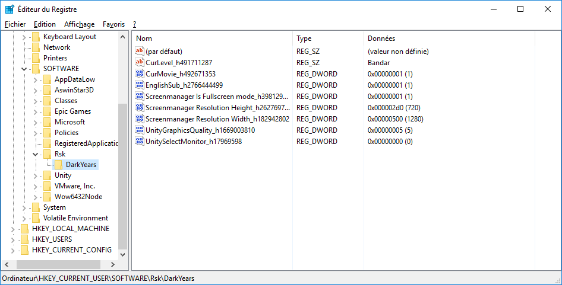

# Dark Years

Encore un jeu obscur des tréfonds de Steam, testé par [LNJ en live](https://www.youtube.com/watch?v=NK1tQMmu6Og) mais aussi par [Vinesauce](https://www.youtube.com/watch?v=9tsJ_rbXkhM) ("Vinny plays one of the worst games on steam")

... et encore un jeu fait sous Unity, ce qui veut dire que je peux aller voir ce qui se passe dans le code. :stuck_out_tongue: Et j'ai pas été déçue.

## Le mod

Ce dossier contient un petit mod qui modifie légèrement le jeu (détaillé dans les points suivants).

Pour l'installer, créer un dossier à côté de `DarkYears.exe`, extraire le zip généré par le job dedans, et lancer `Install.bat`.

Pour le désinstaller, aller dans `DarkYears_Data\Managed`, supprimer `Assembly-UnityScript.dll` et renommer `Assembly-UnityScript-vanilla.dll` en `Assembly-UnityScript.dll`.

## La sauvegarde de la progression

La progression du joueur est enregistrée... dans le Registre :

L'idée de mettre ça dans le Registre peut paraître étrange, mais la décision vient de [Unity](https://docs.unity3d.com/ScriptReference/PlayerPrefs.html) en fait...

Lorsque le jeu veut afficher une cinématique, il change la valeur de `CurMovie` et il charge le niveau `cutscenes` :sparkles:

Il y a une entité nommée `savereg` qui met à jour ces données de sauvegarde, et en parcourant les niveaux, j'ai pu lister les différentes valeurs possibles. **Le mod rajoute un "level select"** à l'écran titre pour choisir parmi ces valeurs... mais les niveaux ne sont pas dans l'ordre, parce que je n'ai pas joué au jeu. :stuck_out_tongue:

:warning: **Attention, le level select écrase les données de sauvegarde.** Si vous y tenez vraiment, vous pouvez en faire une sauvegarde et la restaurer avec l'éditeur de Registre. :sweat_smile:

## L'écran de chargement

L'écran de chargement est blindé de bugs : les points en bas à droite sont censés bouger toutes les 0,3 secondes et les images d'arrière-plan toutes les 2 secondes, mais en pratique, ça n'arrive qu'une fois... la plupart du temps.

En gros, les développeurs ont voulu programmer : "on change d'image de fond quand le temps passé depuis le début de la scène = le temps passé depuis le début de la scène + 2 secondes"... mais vu qu'ils ont utilisé [`Time.time`](https://docs.unity3d.com/ScriptReference/Time-time.html), ils ont programmé :  "on change d'image de fond quand le temps passé depuis le début de la scène = le temps passé depuis **le lancement du jeu** + 2 secondes". Donc tu as une chance de voir l'image changer 2 fois si tu fais "continuer" très très vite après avoir lancé le jeu.

Mais le point le plus embêtant est que **l'écran de chargement attend 10 secondes avant de charger le prochain niveau**. Oui, le jeu allonge artificiellement les temps de chargement, alors qu'il n'y a rien sur l'écran de chargement. **Le mod supprime ce temps de chargement artificiel**.
