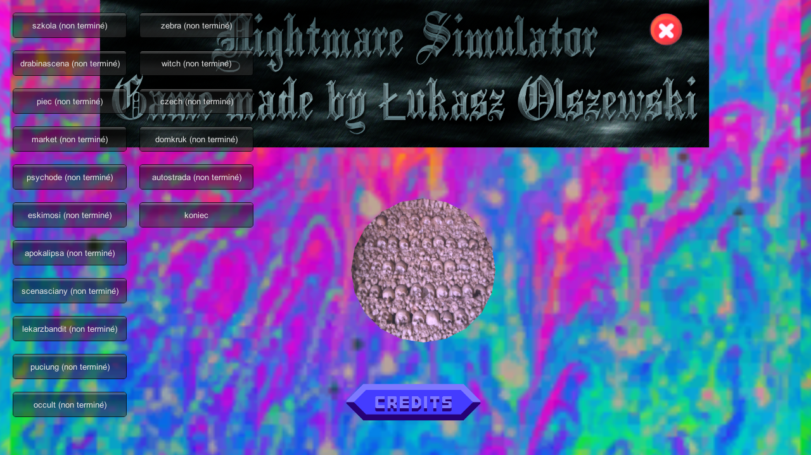

# Nightmare Simulator

Une série de ... trucs extrêmement random [en vente sur Steam](https://store.steampowered.com/app/809790/Nightmare_Simulator/) et [testé en stream sur la chaîne des Navets Jouables](https://www.youtube.com/watch?v=hGtx5KVeaNc).

Dans ce jeu, il y a un level select sous la forme d'une roue qu'on doit arrêter sur le niveau qu'on veut... mais on a vu en live que ça marchait pas très bien, et que ça envoyait souvent sur le même niveau. :stuck_out_tongue: Donc j'ai appliqué la même recette que [Air Control](../AirControl) (vu que c'est aussi un jeu Unity) pour ajouter des boutons pour choisir le niveau qu'on veut depuis le menu principal :

(**Trigger warning :** la cinématique de fin accessible par le bouton "koniec" est une vidéo évoquant le suicide. Le jeu a voulu nous rappeler que c'était un spin-off de [Psychiatrist Simulator](https://store.steampowered.com/app/791590/Psychiatrist_Simulator/), je suppose. :sweat:)

Pour installer le level select, créer un dossier à côté de `Nightmare Simulator.exe`, extraire le zip généré par le job dedans, et lancer `Install.bat`.

Pour le désinstaller, aller dans `Nightmare Simulator_Data\Managed`, supprimer `Assembly-CSharp.dll` et renommer `Assembly-CSharp-vanilla.dll` en `Assembly-CSharp.dll`.

