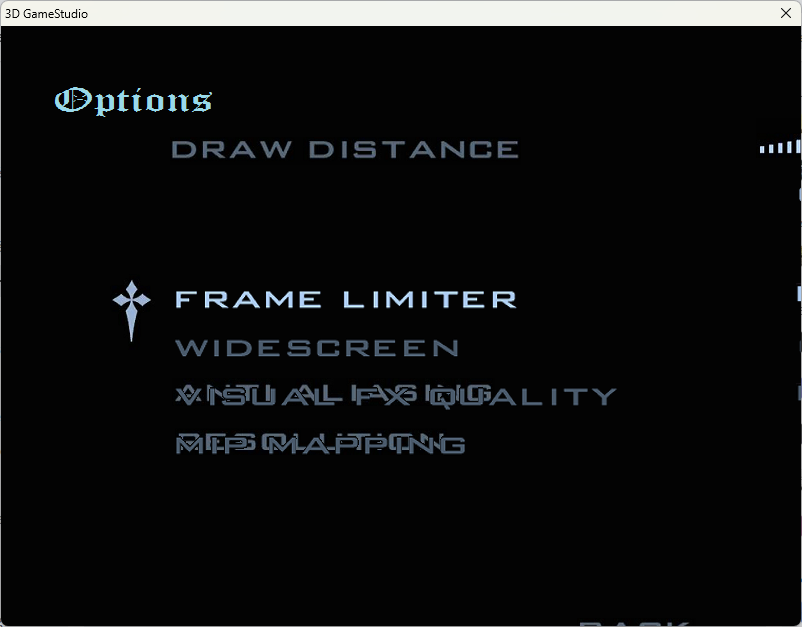
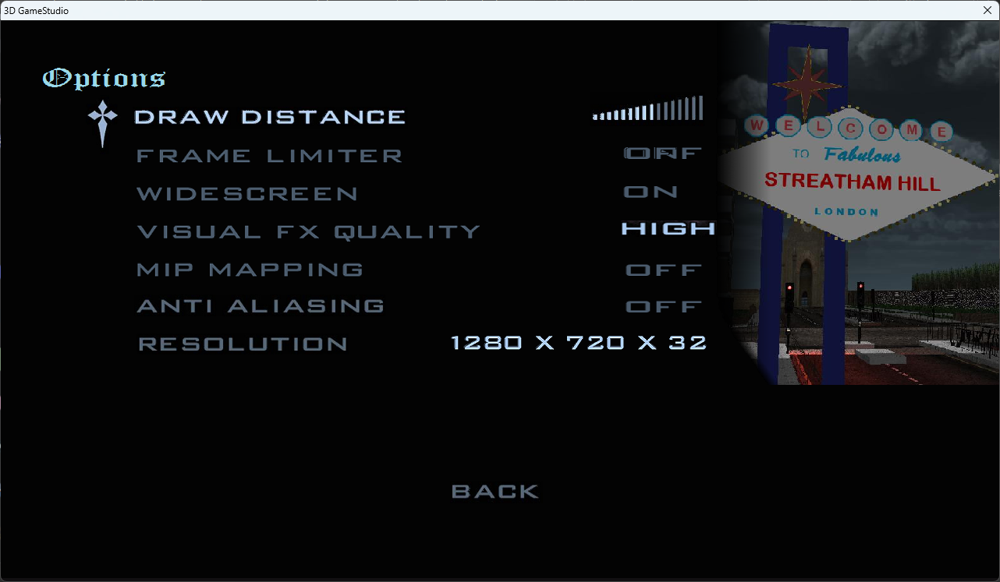
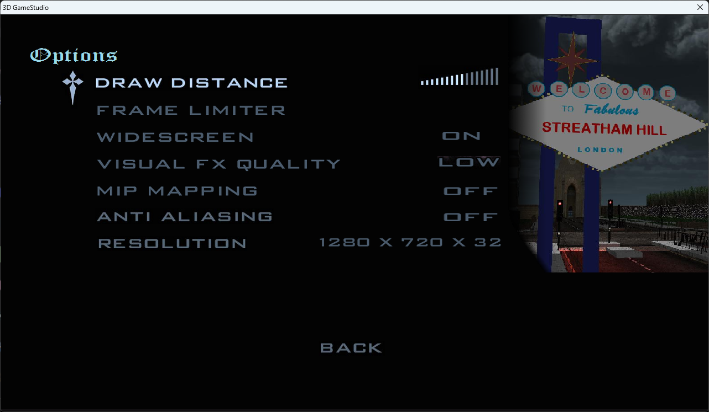
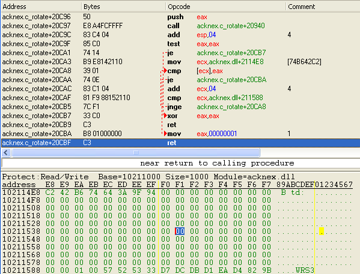

# Streatham Hill Stories

Ce jeu est disponible sur [Steam](https://store.steampowered.com/app/1423980/Streatham_Hill_Stories/) pour la somme de 4€ et se décrit comme un "clone de GTA situé dans le sud de Londres". Il a été développé avec [GameStudio](http://manual.conitec.net/). Sauf que voilà... il est pas _très très_ bien fait. :stuck_out_tongue: Le pilotage des véhicules en particulier est quasiment impossible ainsi que... la navigation dans les menus.

A noter que [le site d'aide du jeu](http://streathamhillstories.com/help.htm) est plutôt informatif, donnant la liste des touches et certaines... bidouilles pour que le jeu fonctionne.

## Les menus du jeu

Une particularité des interfaces de ce jeu est que toutes les positions sont codées en dur, et les résolutions prévues sont 1280x720, 1440x900 et 1920x1080. Les autres résolutions semblent avoir un support relativement... aléatoire, comme le montre l'interface que le jeu m'a montré quand il est passé inexplicablement en 800x600 en plein écran :



En parlant des options, voici le menu :



Et oui, il est possible de sélectionner plusieurs options à la fois.

- **Draw Distance** : 3 positions. Sauvegardé dans `Main/GameSettings.txt`, c'est le premier chiffre qui va de 1 à 3.
- **Frame Limiter** : Limite le jeu à 30 FPS s'il est activé. Sauvegardé dans `Main/GameSettings.txt`, c'est le deuxième chiffre. 0 pour non, 1 pour oui.
- **Widescreen** : _Ne peut pas être modifié._
- **Visual FX Quality** : 3 positions. Sauvegardé dans `Main/GameSettings.txt`, c'est le troisième chiffre qui va de 1 à 3.
- **Mip Mapping** : Sauvegardé dans `Main/MipMapping.txt`, 0 pour non, 1 pour oui.
- **Anti Aliasing** : Sauvegardé dans `Main/AntiAliasing.txt`, 0 pour non, 1 pour oui.
- **Resolution** : Sauvegardée dans `Main/DisplayConfig.txt`, 4 chiffres : largeur, hauteur, nombre de bits, 1 pour plein écran / 0 pour fenêtré. (Il est donc possible de jouer en fenêtré en modifiant ce fichier manuellement, mais pas en passant par le menu.)

A noter qu'il est possible de modifier la résolution du menu, en éditant `DisplayMenu.txt`, qui a le même format que `Main/DisplayConfig.txt`.

Autres options qui sont uniquement mentionnées sur [le site d'aide du jeu](http://streathamhillstories.com/help.htm) :
- dans `Main/Controller.txt`, écrire 0 désactivera la manette, 1 configurera une manette générique, et 3 une manette de Xbox. Si si, c'est une feature. **Il est recommandé de mettre 0 dans `Main/Controller.txt` si tu n'utilises pas de manette**, parce qu'il semblerait que certaines fonctions du jeu vérifient les boutons de la manette ... même s'il n'y en a aucune de branchée. Ce qui peut poser quelques soucis.
- dans `Main/PlayerName.txt`, tu peux personnaliser ton pseudo pour le online du jeu.

Attention, lorsque plusieurs options sont sélectionnées à la fois, comme dans le screenshot, le jeu va écrire plusieurs valeurs dans `Main/GameSettings.txt`. Ici, la distance d'affichage est 2 et 3 à la fois, le frame limiter est 0 et 1 à la fois, et la qualité est à 3, donc le jeu va écrire : `2 3 1 0 3`. Et au moment de relire le fichier, il va lire : "distance d'affichage = 2, frame limiter = 3, qualité = 1", ce qui donne ... ça.



... ce qui ne correspond pas du tout aux réglages qui ont été enregistrés. En fait, il est peut-être plus simple d'ouvrir les fichiers txt pour configurer le jeu que de passer par le menu.

## Les sauvegardes

Les données de sauvegarde sont éparpillées dans plusieurs fichiers TXT :

- `Account.mon` : ton compte en banque
- `Audi.txt` : est-ce que t'as débloqué la voiture ?
- `Colour.txt` : la couleur de ta voiture (elle peut être repeinte en une couleur _aléatoire_ dans le garage du jeu)
- `Flat.txt` : est-ce que t'as débloqué l'appartement ?
- `Mission.txt` : à quelle mission du jeu tu en es ? (de 0 à 6, 0 étant la cinématique d'intro, 6 étant la fin du jeu)
- `Mobile.txt` : est-ce que tu as débloqué le téléphone portable ?

Il est possible de les remettre à zéro en appuyant sur P en jeu et en sélectionnant "nouvelle partie", mais... ça remet aussi à zéro certains paramètres graphiques (draw distance = moyenne, frame limiter = off, qualité = high).

## Les périodes spéciales

- Halloween : du 31/10 à 20h au 01/11 à 7h, la musique change et il y a des zombies sur la map !
- Noël : du 12/12 au 12/01 inclus, la musique change, il y a quelques décos de Noël et des chances qu'il neige.

## Le modding

Oui, il est possible de modder ce truc. En fait, le code source est visible _en clair_ dans les fichiers `.wdl`... mais le jeu a des protections contre la modification.

De ce que j'ai compris, le jeu fait un genre de hash du fichier sur 4 octets, et le compare à une liste de hash autorisés qui sont stockés dans `acknex.dll`. Je ne sais pas trop comment ce hash est calculé, mais je crois avoir trouvé le code qui compare ce hash avec les hash autorisés :



Ce qui donnerait (à peu près) ça en C :

```c
uint32_t hash = c_rotate_20940();
if (hash == 0) return 0;
uint32_t* pointer = 0x2114E8;
while (pointer < 0x211588) {
    if (*pointer == hash) return 1;
    pointer += 4;
}
return 0;
```

En prenant un éditeur hexa, on peut modifier `0x2F5CA` pour mettre `EB` (`jmp`) à la place de `74` (`je`), et paf :
```c
uint32_t hash = c_rotate_20940();
if (hash == 0) return 0;
uint32_t* pointer = 0x2114E8;
while (pointer < 0x211588) {
    // if (*pointer == hash)
        return 1;
    pointer += 4;
}
return 0;
```

La méthode renvoie 1 quel que soit le hash (sauf 0, mais bon hein).

Et pour finir, il faut faire sauter une protection que le moteur du jeu a contre la modification de son propre code... mais heureusement, GameStudio a une option de ligne de commande pour ça : `-nc`.

**En résumé :**
- modifier `Main/acknex.dll` pour changer l'octet à la position `0x2F5CA` de `74` à `EB`
- faire un raccourci vers `Main/shsprogram.exe` avec les options `-nx60 -diag -nc`

Et pouf, vous pouvez maintenant modifier les fichiers `.wdl` du jeu pour changer son code.

## La console

... Et du coup j'ai préparé un petit patch pour rajouter une console au jeu. Il est dans ce dossier, c'est `shsprogram.diff`. Il peut être appliqué au jeu en se mettant à la racine du jeu, et en faisant `git apply shsprogram.diff`.

Ensuite, en appuyant sur ², la console s'ouvre en haut à gauche et permet d'exécuter du code arbitraire :sparkles:

Quelques commandes notables :
- `ph_setgravity(0, 0, -386))` - changer la gravité du monde (-386 étant celle par défaut, visiblement)
- `bipedPhy01_gravity = 10` - changer la gravité des piétons (10 étant celle par défaut)
- `christmas = 1` / `halloween = 1` - active les effets de Noël / Halloween (au moins partiellement)
- `Poo_show()` - le jeu fait caca sur ton écran. Oui, t'es censé pouvoir faire caca sur les autres joueurs si tu joues l'oiseau en multi. C'est une feature.
- `ent_morph(plBiped01_entity, "xxx.mdl")` - transformer son personnage en solo en (une version miniature de) l'un des personnages du multi : `Pedestrian02`, `FbiAgentMP`, `jessica`, `MainPlayerMP`, `walkwomen1`, `walkwomen2MP`, `john`, `Pedestrian03`, `simon`, `ToniMP`

Et voici quelques commandes ajoutées par le patch, pour activer certaines fonctions du jeu plus facilement :
- `TheDayBefore(min, max)` - fait spawn des zombies à intervalle aléatoire de `min` à `max` secondes, comme le mode Halloween du jeu
- `TheDayAfter()` - arrête de faire spawn des zombies
- `ClioInYourFace()` - fait spawn une Clio invisible à la même position que le personnage, et il est possible de monter dedans pour partir dans l'espaaaaace
- `SpawnR8()` - fait spawn une Audi R8 miniature, qui va tenter maladroitement de s'insérer dans le trafic, et qui tourne _beaucoup_ trop vite
- `EnterBowling()` / `ExitBowling()` / `EnterCaesars()` / `ExitCaesars()` - entre et sort de 2 lieux qui ne semblent pas avoir été implémentés (mais on a quand même le son)
- `SpawnBicycle()` - fait spawn ce qu'il reste d'un vélo dans le code du jeu, avec le modèle d'une Audi R8 (parce que le modèle du vélo fait planter le jeu)
