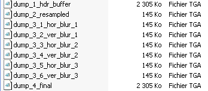

# Vera Jones

"Vera Jones : La Légende des sept reliques" est un jeu d'aventure et... d'escalade, qui est en fait adapté d'un blockbuster russe totalement inconnu en-dehors de Russie : "Скалолазка и Последний из Седьмой колыбели" (littéralement "L'alpiniste et le dernier du septième berceau"). Il a aussi été sorti en Allemagne sous le nom "Vertical Mission: Die Legende der Sieben Artefakte", et peut-être sous le nom "Climber Girl" ailleurs. :shrug: Le jeu a [presque été fini en live LNJ](https://www.youtube.com/watch?v=tMIX8wH_CKI).

Le scénario : une civilisation ancienne a laissé 7 ~~berceaux~~ reliques qui doivent s'activer dès que l'humanité est en danger. Il se trouve que la fin du monde approche, et une méchante méga-corporation cherche à s'emparer des reliques pour _contrôler le monde_. Sauf que notre héroïne, ~~Alena Ovchinnikova~~ Vera Jones, en trouve une et se retrouve en plein milieu de tout ce bazar avec plein de gens qui essaient de la buter... et puis elle fait de l'escalade, aussi.

Fun fact : il y a un patch pour traduire la version française en anglais [sur GitHub](https://github.com/SuiMachine/Vera-Jones-English-Translation). En ouvrant les fichiers, il est possible de lire les sous-titres du jeu et de voir le scénario même sans avoir le jeu !

## Le mode développeur

Oui, ce jeu a aussi un mode test ! Pour y accéder, il faut lancer le jeu avec le paramètre `-dev` (par exemple en modifiant un raccourci et en ajoutant `-dev` à la fin de la cible).

### La console

La console s'active en appuyant sur ². Il y a des commandes qui donnent la liste (incomplète) des commandes et des variables, que voici :
```
> set con_writetofile true
> cmdlist
cmdlist
cvarlist
writeconfig
exec
clear
set
vid_restart
ll
quit
supergirl
show_retreats
show_waypoints
s_SetMusic
s_PlaySound
s_StopAllSounds
s_TestSound
s_Test3DSound
dump_sounds
1
3
s_SetEnv
shot
screenshot
dump_shit
test_shader_cmd
quit!
r_SetEffect
flash_dyn
flash_stat
> cvarlist
con_WriteToFile
FullScreen
ScreenWidth
ScreenHeight
view_aim
mouse_inverse
mouse_sens
key_move_fwd
key_move_bwd
key_move_left
key_move_right
key_next_weapon
key_toggle_run
key_jump
key_reload
key_drop_weapon
key_show_debug_string
key_tasks
key_run
key_use_item
key_melee
key_beretta
key_usp
key_ingram
key_ak47
hints_on
enable_hint
g_hero_speed
g_enemies_speed
s_ShowDebugMessages
s_MusicVolume
s_SoundVolume
s_Volume
s_RestartMenuMusic
s_ShowBoxes
r_ShadowQuality
r_enableHDR
r_LimitShadersVer
sh_CheckShaders
r_HDR_BrightPassThreshold
r_HDR_BloomMult
r_HDR_NumBloomPasses
r_OutdoorShadows
enable_physics
show_bots
r_noHUD
sh_FogCoeff
r_noShaders
r_onlySorted
r_skipSorted
```

Quelques commandes notables :
- `cmdlist` / `cvarlist` : permet de lister les commandes et les variables, respectivement.
- `ll [0-9]` : charge un niveau.
- `dump_shit` : exporte une poignée de buffers vidéos dans le dossier du jeu.



- `diba` (non-documentée) : dit `Hello :)` dans la console, puis tente de jouer un son qui n'existe pas. :thinking: :thinking:

Quelques variables notables :
- `con_WriteToFile` : permet d'écrire le contenu de la console dans `console.txt` dans le dossier du jeu.
- `FullScreen` : bascule entre fenêtré et plein écran. (Oui, le jeu n'a pas d'option pour ça. Il faut redémarrer le jeu ou taper `vid_restart` pour que le changement d'option prenne effet.)
- `ScreenWidth` / `ScreenHeight` : permet de personnaliser la résolution. Le jeu apparaîtra écrasé pour les résolutions qui ne sont pas en 4:3, donc rip le 1080p :stuck_out_tongue: (Il faut redémarrer le jeu ou taper `vid_restart` pour que le changement d'option prenne effet.)
- `s_ShowDebugMessages` : affiche plus de messages de debug liés au son dans la console.
- `s_Volume` : le volume du jeu, entre 0 et 1... bon OK, il est possible de mettre plus de 1 aussi :loudspeaker:
- `s_ShowBoxes` : affiche des ... boîtes qui clignotent. Vu le préfixe `s_`, ça doit avoir un rapport avec le son :thinking:
- `show_bots` : affiche plein d'informations en rouge par-dessus les ennemis contrôlés par l'ordinateur.
- `r_noHUD` : désactive l'interface du jeu.

Taper le nom d'une variable permet de voir sa valeur, taper `set [nom_variable] [valeur]` permet de la changer.

### Les touches

- T : passer en free cam. Appuyer à nouveau téléporte Vera à l'emplacement de la caméra, et quitte la free cam.
- W : attire tous les objets vers Vera
- X : repousse tous les objets

## Le fichier de constantes de gameplay

Dans les fichiers du jeu, il y a `Data\gameplay.lua` qui contient quelques constantes de jeu, qui peuvent être modifiées en éditant simplement le fichier :

```lua
-- misc gameplay variables

gfBonusLife = 0.01;
gdwLifeTimeOut = 1000;--1Sec

-- stamina run decrease (per second)
gfStaminaRunCoef = 1;

-- stamina jump decrease (per one jump)
gfStaminaJumpCoef = 10;

-- stamina increase (per second)
gfStaminaRecoverCoef = 2;

-- show portals
giShowPortals = 0;

-- fly camera velocity
gfFlyCameraVelocity = 4.0;

-- EAX per-level environments
EAX_env_level0 = 2;
EAX_env_level1 = 11;
EAX_env_level2 = 5;
EAX_env_level3 = 19;
EAX_env_level4 = 5;
EAX_env_level5 = 16;
EAX_env_level6 = 22;
EAX_env_level7 = 18;
EAX_env_level8 = 8;
EAX_env_level9 = 5;
```

