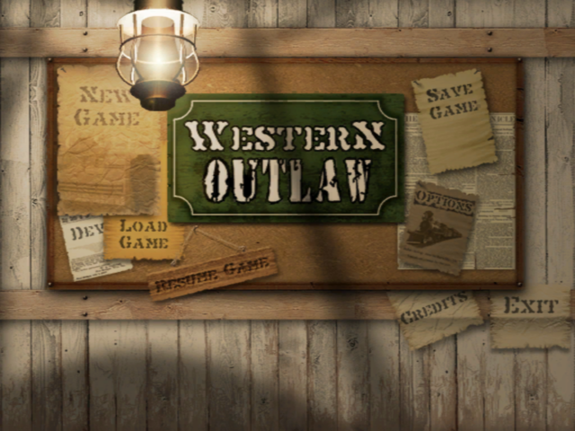

# Western Desperado

Aussi connu sous le nom "Western Outlaw: Wanted Dead or Alive", c'est un FPS western sorti en 2003. Il a été testé plusieurs fois en live, et [il y a très longtemps en vidéo](https://www.youtube.com/watch?v=gLab1W8lT8Y). Les graphismes de ce jeu ont tendance à buguer : dans les tests de LNJ, les personnages ont des mentons énormes, et sous Proton les personnages sont invisibles, ou ils sont bugués en échangeant parfois leurs têtes (avec l'option `PROTON_DXVK_D3D8=1`).

## Les options de debug

Dans `autoexec.cfg` se trouvent quelques options intéressantes... dont beaucoup n'ont aucun effet. Mais voici celles que j'ai notées :

- `"windowed" "1"` : passer le jeu en fenêtré
- `"screenwidth" "1024"` et `"screenheight" "768"` : personnaliser la résolution de l'écran
- `"VarTrackType" "0"` : l'écran est recouvert de quelques variables de debug en passant le nombre à 1, 2 ou 3
- `"PlayerClip" "1"` : passer à 0 pour passer en mode noclip et voler librement dans les niveaux
- `"splashscreens" "0"` : ne pas afficher les logos au lancement du jeu

## Les ressources du jeu

Le jeu utilise le moteur LithTech, et les ressources du jeu sont stockées dans un fichier nommé `Western_Outlaw.rez`. Il est possible d'extraire ce fichier avec [QuickBMS](https://aluigi.altervista.org/quickbms.htm), révélant les textures, modèles, scripts etc. du jeu. Le code du jeu semble être compilé et contenu dans `CSHELL.DLL`, mais les scripts des niveaux sont dans `SCRIPT\AUTORUN`, sous forme de fichiers texte qu'il est possible d'éditer.

Après avoir extrait les ressources du jeu dans un dossier nommé `DataFiles` dans le dossier du jeu (à côté de `Music` et `Save`), il suffit de se positionner dans le dossier du jeu et de lancer : `lithtech.exe -rez DataFiles`, donc pas besoin de reconstruire `Western_Outlaw.rez` pour modder le jeu !

Lorsque plusieurs paramètres `-rez` sont passés, LithTech va les fusionner (avec le dernier de la liste prenant la priorité), donc il est possible d'avoir plusieurs dossiers de mod qui remplacent des parties du jeu, et de rajouter/enlever des options pour les activer/désactiver :sparkles:

Il existe un outil, [LithTools](https://haekb.itch.io/lithtools), qui permet de visualiser les textures (DTX) et de les exporter en PNG.

## Le Level Select du pauvre

Il est possible de sauter des niveaux... en remplaçant leur script par "charge le niveau suivant". Donc lancer une nouvelle partie va enchaîner les chargements de niveaux jusqu'au niveau souhaité. C'est peut-être pas la manière la plus efficace de faire, mais ça marche :david_goodenough:

- Télécharger [LevelSkip.zip](https://github.com/maddie480/BazarLNJ/raw/refs/heads/main/WesternDesperado/LevelSkip.zip) et l'extraire dans le dossier du jeu
- Dans `LevelSkip\SCRIPT\AUTORUN`, supprimer le fichier du niveau désiré et tous les suivants (pour aller à `ACT1M3`, il ne doit rester plus que `ACT1M1.TXT` et `ACT1M2.TXT` dans le dossier)
- Lancer le jeu avec la commande ou un raccourci pointant vers : `lithtech.exe -rez Western_Outlaw.rez -rez LevelSkip`

## Le mode dev (qui n'est plus dans le jeu ?)

Il y a beaucoup de références à un mode dev ("DEVELOPMENT MENU" dans l'exécutable du jeu, une option "Dev" dans `autoexec.cfg`, des textures...) mais je n'ai pas trouvé de moyen pour y accéder (ni à une console d'ailleurs) :pensive:

Une image qui se trouve parmi les textures du menu montre à quoi ça aurait pu ressembler :

(On remarque aussi une option "Credits" qui est elle aussi absente du jeu.)

## La sortie standard du jeu

Le jeu écrit des messages de debug sur la sortie standard (une invite de commandes dans une fenêtre séparée), qu'il est possible de réactiver en faisant de `lithtech.exe` une application console, au lieu d'une application graphique (ce qui fait que Windows va ouvrir une invite de commandes pour afficher les messages).

Méthode qui devrait fonctionner pour n'importe quel exe :

- Ouvrir `lithtech.exe` dans un éditeur hexadécimal
- Chercher `0x010B` (qui marque le début du [PE Optional header](https://wiki.osdev.org/PE#Optional_header))
- Avancer de `0x46` octets pour tomber sur un octet qui devrait être `0x02` (qui représente le "sous-système application graphique")
- Le changer en `0x03` (qui représente le "sous-système console")