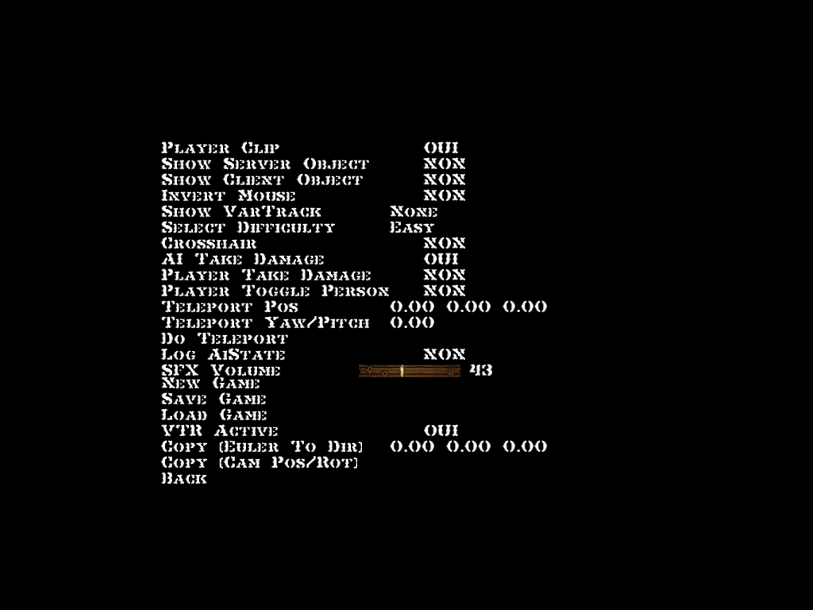

# Western Desperado

Aussi connu sous le nom "Western Outlaw: Wanted Dead or Alive", c'est un FPS western sorti en 2003. Il a été testé plusieurs fois en live, et [il y a très longtemps en vidéo](https://www.youtube.com/watch?v=gLab1W8lT8Y). Les graphismes de ce jeu ont tendance à buguer : dans les tests de LNJ, les personnages ont des mentons énormes, et sous Proton les personnages sont invisibles, ou ils sont bugués en échangeant parfois leurs têtes (avec l'option `PROTON_DXVK_D3D8=1`).

## Les options de debug

Dans `autoexec.cfg` se trouvent quelques options intéressantes... dont beaucoup n'ont aucun effet. Mais voici celles que j'ai notées :

- `"windowed" "1"` : passer le jeu en fenêtré
- `"screenwidth" "1024"` et `"screenheight" "768"` : personnaliser la résolution de l'écran
- `"splashscreens" "0"` : ne pas afficher les logos au lancement du jeu

## Les ressources du jeu

Le jeu utilise le moteur LithTech, et les ressources du jeu sont stockées dans un fichier nommé `Western_Outlaw.rez`. Il est possible d'extraire ce fichier avec [QuickBMS](https://aluigi.altervista.org/quickbms.htm), révélant les textures, modèles, scripts etc. du jeu. Le code du jeu semble être compilé et contenu dans `CSHELL.DLL`, mais les scripts des niveaux sont dans `SCRIPT\AUTORUN`, sous forme de fichiers texte qu'il est possible d'éditer.

Après avoir extrait les ressources du jeu dans un dossier nommé `DataFiles` dans le dossier du jeu (à côté de `Music` et `Save`), il suffit de se positionner dans le dossier du jeu et de lancer : `lithtech.exe -rez DataFiles`, donc pas besoin de reconstruire `Western_Outlaw.rez` pour modder le jeu !

Lorsque plusieurs paramètres `-rez` sont passés, LithTech va les fusionner (avec le dernier de la liste prenant la priorité), donc il est possible d'avoir plusieurs dossiers de mod qui remplacent des parties du jeu, et de rajouter/enlever des options pour les activer/désactiver :sparkles:

Il existe un outil, [LithTools](https://haekb.itch.io/lithtools), qui permet de visualiser les textures (DTX) et de les exporter en PNG.

## Le Level Select du pauvre

Il est possible de sauter des niveaux... en remplaçant leur script par "charge le niveau suivant". Donc lancer une nouvelle partie va enchaîner les chargements de niveaux jusqu'au niveau souhaité. C'est peut-être pas la manière la plus efficace de faire, mais ça marche :david_goodenough:

- Télécharger [LevelSkip.zip](https://github.com/maddie480/BazarLNJ/raw/refs/heads/main/WesternDesperado/LevelSkip.zip) et l'extraire dans le dossier du jeu
- Dans `LevelSkip\SCRIPT\AUTORUN`, supprimer le fichier du niveau désiré et tous les suivants (pour aller à `ACT1M3`, il ne doit rester plus que `ACT1M1.TXT` et `ACT1M2.TXT` dans le dossier)
- Lancer le jeu avec la commande ou un raccourci pointant vers : `lithtech.exe -rez Western_Outlaw.rez -rez LevelSkip`

## Les menus de dev

Plusieurs images qui se trouvent parmi les textures du menu semblent indiquer qu'il y avait un bouton "Dev" (ainsi qu'un bouton "Credits") dans le menu principal :

(La texture est stockée en 512x512 dans les fichiers du jeu, je l'ai redimensionnée en 640x480 pour éviter qu'elle soit écrasée.)

Je n'ai pas trouvé de trace de ce bouton dans le menu final, mais à force de tabasser la RAM du jeu, j'ai fini par trouver un moyen d'afficher plusieurs menus de dev :tada:

Il est possible de modifier la cible du bouton "Options" pour pointer vers ce menu de dev en modifiant `CSHELL.DLL+1F8D0`, en remplaçant `0x7D` par `0x1E`.

2 méthodes pour le faire :

- En mémoire, en utilisant [Cheat Engine](https://www.cheatengine.org/)
  - lancer le jeu
  - s'attacher au jeu (lithtech.exe)
  - ouvrir la "Memory View"
  - utiliser Ctrl+G pour sauter vers `CSHELL.DLL+1F8D0`
  - le curseur devrait se positionner sur un `7D`, juste taper `1E` à la place
  - les modifications seront perdues à la fermeture du jeu
- Dans les fichiers du jeu, avec un éditeur hexadécimal
  - `CSHELL.DLL` est stocké à l'intérieur de `Western_Outlaw.rez`, mais ce n'est pas très problématique :
    - lancer le jeu
    - dans l'explorateur de fichiers, aller dans `%tmp%`
    - copier `CSHELL.DLL` dans un sous-dossier à côté du jeu, `mod` par exemple
  - modifier le fichier avec un éditeur hexadécimal
    - à l'index `0x1F8D0`, remplacer `7D` par `1E`
  - relancer le jeu avec la commande : `lithtech.exe -rez Western_Outlaw.rez -rez french.rez -rez mod`
    - le jeu peut être lancé normalement avec le raccourci habituel, ou en enlevant `-rez mod` à la fin de la commande

Ce qui donne ceci en cliquant sur "Options" dans le menu principal :

### Menu "Tools"

Quelques options notables :
- "Player Clip" : désactiver pour passer en mode noclip, et voler librement dans les niveaux en passant à travers les murs
- "Show VarTrack" : affiche des variables à l'écran, avec 3 options : "inventory" (armes), "dynamic sfxs" (sons) et "empty" (position et orientation de la caméra :trollface:)
- "Player Take Damage" : rend le joueur invincible. Contrairement à ce que l'option laisse entendre, le joueur est toujours blessé par les attaques, mais quand la santé atteint 0, elle remonte à 100 au lieu de déclencher un game over
- "Player Toggle Person" : rend le personnage visible... révélant que c'est un cube blanc. Comme une vue à la 3ème personne, sauf que l'arme apparaît toujours à la 1ère personne. Plutôt une vue à la 4ème personne, du coup.

### Menu "Load World"

... oui, le menu est pt. :pensive:

Mais heureusement, on peut le réparer : il cherche tous les niveaux dont les noms de fichiers finissent par ".dat"... sauf qu'ils finissent par ".DAT" en fait.

Pour le réparer, aller à `CSHELL.DLL+C28B4` (où il devrait y avoir ".dat") et taper ".DAT" à la place. (En cas d'utilisation de Cheat Engine, il faut forcer un rechargement du menu pour que ça ait un effet, ce qui est faisable en changeant la résolution du jeu dans les options normales)

Les options "canyon" et "empty" mènent à un chargement infini, et les autres peuvent servir de Level Select :sparkles: Seul inconvénient, le jeu ne donne pas toujours les armes nécessaires au début du niveau...

### Les autres menus

En modifiant `CSHELL.DLL+1F8F0` (qui vaut `0x15` à la base), il est possible d'accéder à d'autres écrans inutilisés... mais la plupart ne semblent pas avoir d'effet. Par exemple, `0x17` renvoie sur... ça :

## Les crédits inutilisés

L'image plus haut montre en plus du bouton "Dev", un bouton "Crédits" qui n'existe pas dans le jeu... en fait si, il existe, mais il ressemble pas à grand-chose :sweat_smile:

Pour y accéder, aller à `CSHELL.DLL+1F8D0` et remplacer `0x7D` par `0x47`, puis cliquer sur "Options" :

## La sortie standard du jeu

Le jeu écrit des messages de debug sur la sortie standard (une invite de commandes dans une fenêtre séparée), qu'il est possible de réactiver en faisant de `lithtech.exe` une application console, au lieu d'une application graphique (ce qui fait que Windows va ouvrir une invite de commandes pour afficher les messages).

Méthode qui devrait fonctionner pour n'importe quel exe :

- Ouvrir `lithtech.exe` dans un éditeur hexadécimal
- Chercher `0x010B` (qui marque le début du [PE Optional header](https://wiki.osdev.org/PE#Optional_header))
- Avancer de `0x46` octets pour tomber sur un octet qui devrait être `0x02` (qui représente le "sous-système application graphique")
- Le changer en `0x03` (qui représente le "sous-système console")

## Les fichiers de log

Il y a une fonctionnalité désactivée qui, si elle est activée, indique au jeu d'écrire plein de logs au format .txt à la racine du disque `C:\` :

Je ne sais pas s'il y a une façon "officielle" de l'activer via les menus de dev, mais il est possible de l'activer en éditant la mémoire (avec Cheat Engine), en écrivant `0x01` dans `CSHELL.DLL+E9D54`.
